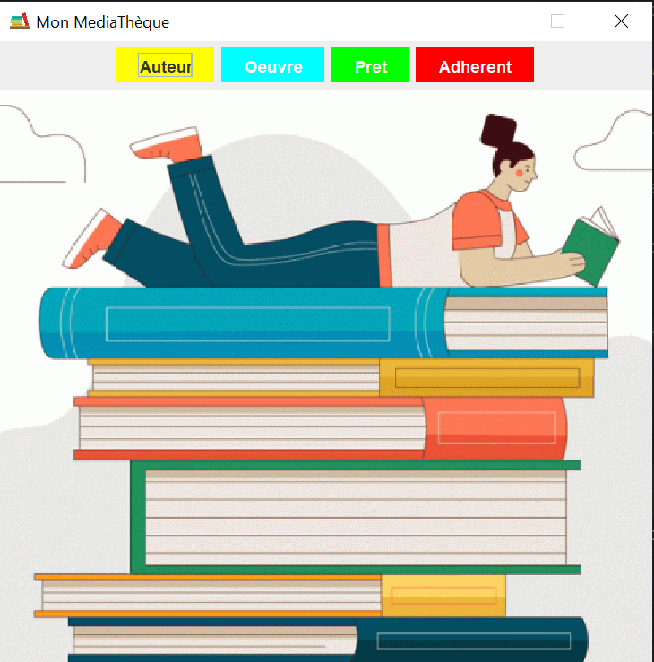

# Mediatheque Application 

Frontend : JavaSwing Graphic interfaces
Backend : Java JEE Architecture
Database : XML

### Prerequisites
- java JDK 19
- jdom 2.0.6

# Getting Started
- Clone the project
- Import the project in your IDE
- Run the project
- Enjoy

# Authors
- **Anouar Bakouch**.

# License
This project is licensed under the MIT License - see the [LICENSE.md](LICENSE.md) file for details

# Acknowledgments
- Hat tip to anyone whose code was used

# Screenshots

